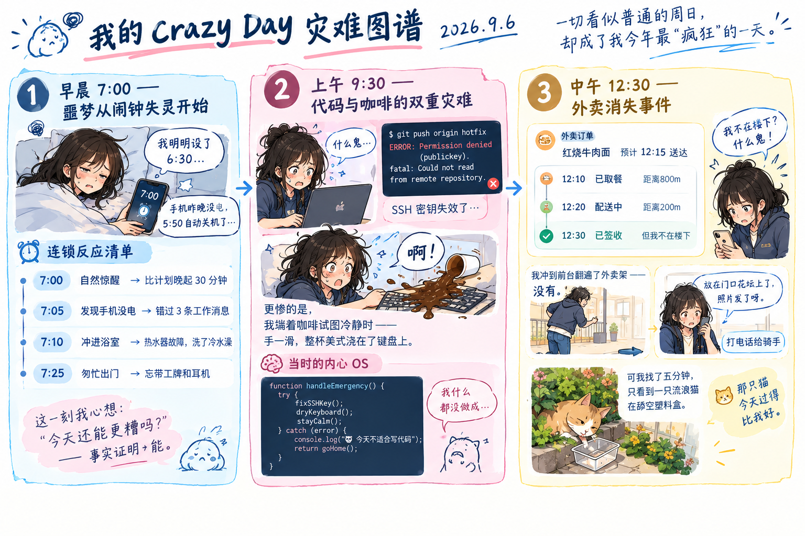

# 当一切失控时，我学会了什么

---

2026年9月6日，一个普通的周日，却成了我今年最"疯狂"的一天。

## 1. 早晨 7:00 —— 噩梦从闹钟失灵开始

手机屏幕显示 7:00，但我明明设置了 6:30 的闹钟。

原因是——昨晚忘记给手机充电，它在 5:50 自动关机了。

### 1.1 连锁反应清单

|时间|事件|后果|
|----|----|----|
|7:00|自然惊醒|比计划晚起 30 分钟|
|7:05|发现手机没电|错过 3 条工作消息|
|7:10|冲进浴室|热水器故障，洗了冷水澡|
|7:25|匆忙出门|忘带工牌和耳机|

这一刻我心想："今天还能更糟吗？"

—— 事实证明，能。

---

## 2. 上午 9:30 —— 代码与咖啡的双重灾难

赶到公司后，我正准备部署一个紧急修复补丁，结果：

```
git push origin hotfix
# ERROR: Permission denied (publickey).
# fatal: Could not read from remote repository.
```

SSH 密钥失效了。更惨的是，我端着咖啡试图冷静时——

手一滑，整杯美式浇在了键盘上。

### 2.1 当时的内心 OS

```
// 我的大脑在那一刻
function handleEmergency() {
  try {
    fixSSHKey();
    dryKeyboard();
    stayCalm();
  } catch (error) {
    // 实际上我什么都没做成
    console.log("💀 今天不适合写代码");
    return goHome();
  }
}
```

---

## 3. 中午 12:30 —— 外卖消失事件

饿着肚子点了份最爱吃的 红烧牛肉面，预计 12:15 送达。

|时间|状态|骑手定位|
|----|----|--------|
|12:10|已取餐|距离 800m|
|12:20|配送中|距离 200m|
|12:30|已签收|但我不在楼下|

我冲到前台翻遍了外卖架——没有。

打电话给骑手，对方说："放在门口花坛上了，照片发了呀。"

可我找了五分钟，只看到一只流浪猫在舔空塑料盒。

🐱 那只猫今天过得比我好。

---

## 4. 下午 15:00 —— 转机从一次"摆烂"开始

坐在工位上，键盘还在滴水，肚子在叫，部署还没搞定。

我决定 不挣扎了。

我打开笔记软件，把今天所有灾难按时间线画成了一张流程图：


